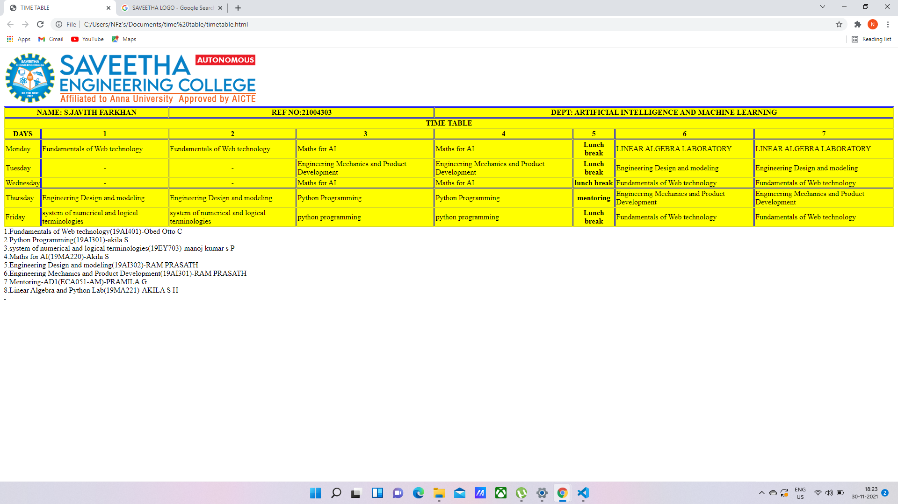

# Experiment_Time_Table

## AIM
To Write a html webpage page to display your timetable.

# ALGORITHM
### STEP 1
create a simple table using table tag
### STEP 2
Add header row using th tag
### STEP 3
Add your timetable
### STEP 4
Execute the program

# CODE
```

 <!DOCTYPE html>
<html>

   <head>
      <title>TIME TABLE</title>
   </head>
	
   <body>
      <table border = "1" cellspacing="1" bordercolor="blue" bgcolor="yellow">
      
          <tr>
            <th colspan="2"> NAME: S.JAVITH FARKHAN 
            <th colspan="2"> REF NO:21004303
            <th colspan="6"> DEPT: ARTIFICIAL INTELLIGENCE AND MACHINE LEARNING</th>
         </tr>
         <tr>
            <th colspan="8">TIME TABLE</th>
          </tr>
         
         <tr>
            <th>DAYS</th>
            <th>1</th>
            <th>2</th>
            <th>3</th>
             <th>4</th>
             <th>5</th>
            <th>6</th>
            <th>7</th>
            
         </tr>
         
        
  
  <tr>
             <td>Monday</td>
             <td>Fundamentals of Web technology</td>
             <td>Fundamentals of Web technology</td>
             <td>Maths for AI</td>
             <td>Maths for AI</td>
         <th>Lunch break</th>
             <td>LINEAR ALGEBRA LABORATORY</td>
             <td>LINEAR ALGEBRA LABORATORY</td>
 </tr>
 <tr>
             <td>Tuesday</td>
             <td><center>-</center></td>
             <td><center>-</center></td>
             <td>Engineering Mechanics and Product Development</td>
             <td>Engineering Mechanics and Product Development</td>
              <th>Lunch break</th>
             <td>Engineering Design and modeling</td>
             <td>Engineering Design and modeling</td>
 </tr>
 <tr>
             <td>Wednesday</td>
             <td><center>-</center></td>
             <td><center>-</center></td>
             <td>Maths for AI</td>
             <td>Maths for AI</td>
             <th>lunch break</th>
             <td>Fundamentals of Web technology</td>
             <td>Fundamentals of Web technology</td>
 </tr>
  <tr>
             <td>Thursday</td>
             <td>Engineering Design and modeling</td>
             <td>Engineering Design and modeling</td>
             <td>Python Programming </td>
             <td>Python Programming</td>
             <th>mentoring</th>
             <td>Engineering Mechanics and Product Development</td>
             <td >Engineering Mechanics and Product Development</td>
 </tr>
 <tr>
             <td>Friday</td>
             <td>system of numerical and logical terminologies</td>
             <td>system of numerical and logical terminologies</td>
             <td>python programming</td>
             <td>python programming</td>
             <th>Lunch break</th>
             <td>Fundamentals of Web technology</td>
             <td>Fundamentals of Web technology</td>
 </tr>
  
         
      </table>
1.Fundamentals of Web technology(19AI401)-Obed Otto C<br>
2.Python Programming(19AI301)-akila S <br>
3.system of numerical and logical terminologies(19EY703)-manoj kumar s P<br>
4.Maths for AI(19MA220)-Akila S <br>
5.Engineering Design and modeling(19AI302)-RAM PRASATH <br>
6.Engineering Mechanics and Product Development(19AI301)-RAM PRASATH <br>
7.Mentoring-AD1(ECA051-AM)-PRAMILA G <br>
8.Linear Algebra and Python Lab(19MA221)-AKILA S H<br>
      
   </body>
</html>

 </tr>
  
         
      </table>
      
   </body>
</html>
```
# OUPUT

